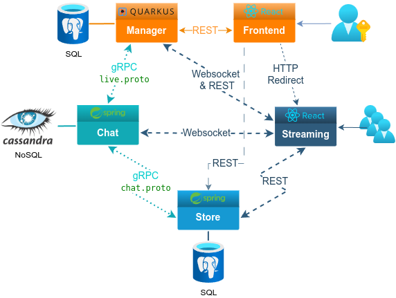
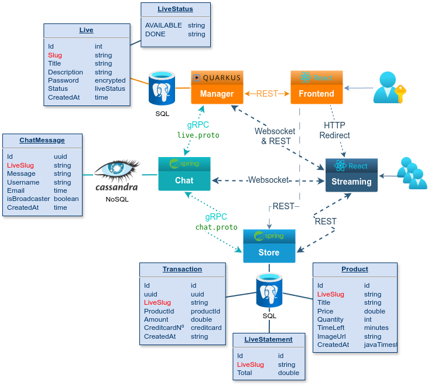

# live-shopping-app

// Gif

It was originally created in order to practice subjects like Reactive Programming, Microservices and related Java frameworks (Spring, Quarkus) along with each Reactive ecosystem (Project Reactor, Eclipse Vert.x / Netty)

As well as frontend programming (HTML, CSS, SASS and React with Typescript) with Figma design tool.

### Overview


See the README.md of each microservice for more info.

<details>
<summary><i>Database entities</i></summary>



</details>

### Usage
The following ports should be available:
```
8080, 8090, 8091, 9000, 9090
5173, 5174
```
**1º Package all java projects**:
```shell script
./package-all-java.sh
```
It will run _"./mvnw package -DskipTests=true"_ in each _"live-***"_ folder.

**2º Just run.**
```shell script
docker compose up -d
```
The total of **9 containers** will be created:
- 3 database + 1 to config (auto exit)
  - Cassandra database + config take a while to complete.
- 3 backend
  - The chat container will keep restarting until the connection with Cassandra database has stabilized.
- 2 frontend

**3º Enjoy.**

Enter in manager-frontend: <br>
http://localhost:5174

</details>

### Info
- JDK 21
  - Quarkus 3.9.3
  - Spring Boot 3.2.5
- Node.js 20
  - React 18.2
  - Typescript 5.2
- IDEs and source-code editors
  - Eclipse IDE 2024-03 (4.31)
  - Spring Tool Suite 4 (4.22)
  - VS Codium (1.87.2)
- Other Tools
  - Docker
  - Insomnium 0.2.3
- System Info
  - MX Linux 23 (Debian 12 Bookworm)
