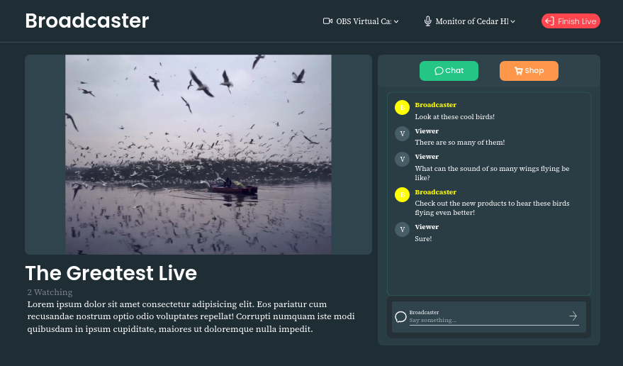
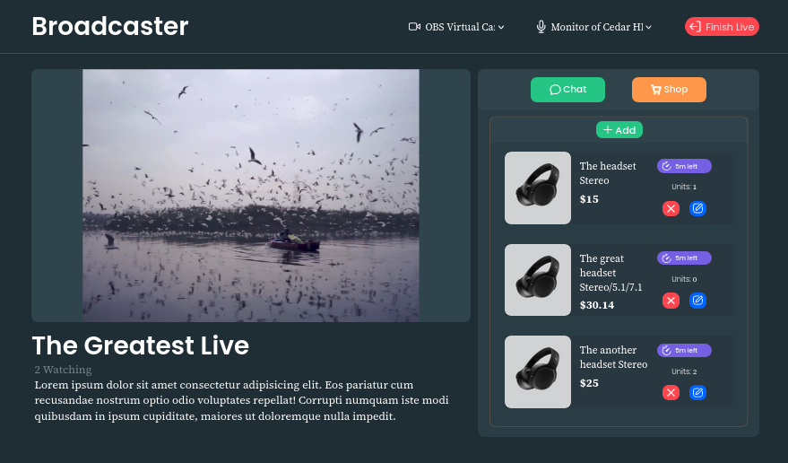
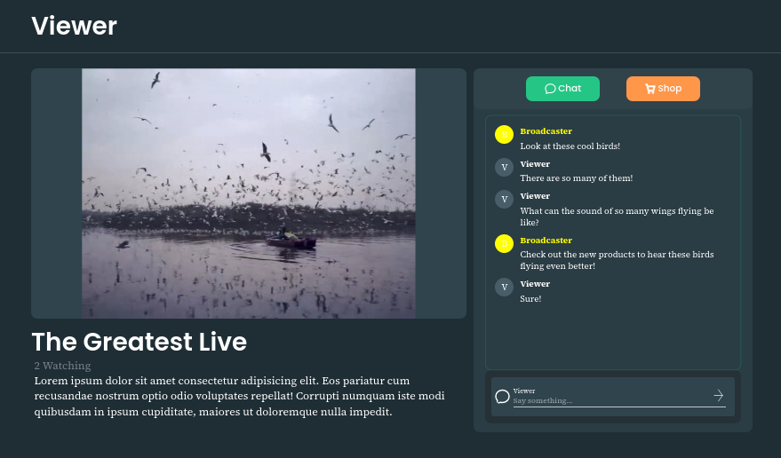
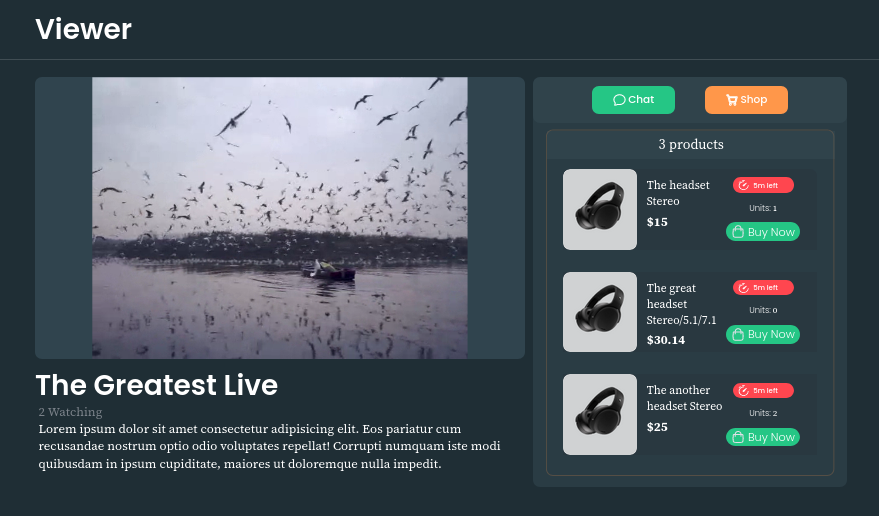

# frontend-streaming

### All responsibilities
- Integrate all services (The app itself :D)

### Notes

There are some unfinished things and lack of polish due to:

1º Estimated time,  
2º It's for the sake of learning,  
3º Limited React skills.

However, the main functionalities have been implemented, which is a good start.

Broadcaster (chat) |  Broadcaster (shop)
:-------------------------:|:-------------------------:|
  |  

Viewer (chat) |  Viewer (shop)
:-------------------------:|:-------------------------:|
  |  